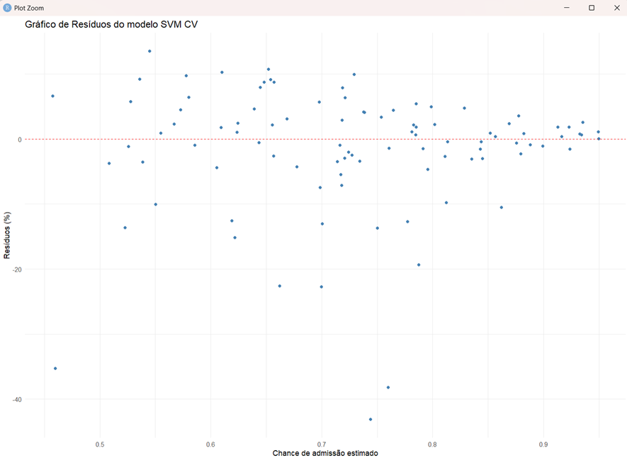

# IAA008-aprendizado-de-maquina

## Equipe 03
-	Gustavo Costa de Souza
-	Marcos Vinicius de Melo
-	Marcus Eneas Silveira Galvao do Rio Apa II
-	Patrícia Verdugo Pascoal
-	Rodrigo de Araujo
-	William de Souza Alencar

## CLASSIFICAÇÃO

Para o experimento de Classificação:	
-	Ordenar pela Acurácia (descendente), ou seja, a técnica de melhor acurácia ficará em primeiro na tabela.
-	Após o quadro colocar:
    -	Um resultado com 3 linhas com a predição de novos casos para a técnica/parâmetro de maior Acurácia (criar um arquivo com novos casos à sua escolha)
    - A lista de comandos emitidos no RStudio para conseguir os resultados obtidos

 ### **Veículos**
 
| Técnica          | Parâmetro                 | Acurácia | Matriz de Confusão |
|------------------|---------------------------|----------|---------------------|
| SVM – CV         | C=100, Sigma=0.015        | 0.82     |                     |
| SVM – Hold-out   | C=1, Sigma=0.07156        | 0.73     |                     |
| RF – CV          | mtry=7                    | 0.73     |                     |
| RNA – CV         | size=21, decay=0.7        | 0.72     |                     |
| RF – Hold-out    | mtry=10                   | 0.71     |                     |
| KNN              | k=1                       | 0.62     |                     |
| RNA – Hold-out   | size=5, decay=0.1         | 0.50     |                     |

O modelo que obteve o melhor desempenho foi o SVM com cross-validation, alcançando uma acurácia de 0,82 com os parâmetros custo (C) = 100 e sigma = 0,015. Esse resultado indica que a técnica de SVM, aliada à validação cruzada e ao ajuste adequado de parâmetros, proporcionou maior capacidade de generalização em comparação aos demais modelos avaliados.

 ### **Diabetes**
 
| Técnica          | Parâmetro                 | Acurácia | Matriz de Confusão |
|------------------|---------------------------|----------|---------------------|
| RF – CV          | mtry=5                    | 0.82     |                     |
| SVM – Hold-out   | C=0.25, Sigma=0.128       | 0.81     |                     |
| SVM – CV         | C=0.25, Sigma=0.128       | 0.81     |                     |
| RNA – CV         | size=3, decay=0.1         | 0.79     |                     |
| RF – Hold-out    | mtry=2                    | 0.79     |                     |
| KNN              | k=9                       | 0.76     |                     |
| RNA – Hold-out   | size=3, decay=0.1         | 0.68     |                     |

O modelo que obteve o melhor desempenho foi o Random Forest com cross-validation, alcançando uma acurácia de 0,82 com o parâmetro mtry = 5. Esse resultado demonstra que a combinação da técnica Random Forest com validação cruzada e ajuste adequado do parâmetro (mtry) via grid search resultou em maior capacidade de generalização em relação aos demais modelos testados.

## REGRESSÃO

Para o experimento de Regressão:

-	Ordenar por R2 descendente, ou seja, a técnica de melhor R2 ficará em primeiro na tabela.
-	Após o quadro, colocar:
    - Um resultado com 3 linhas com a predição de novos casos para a técnica/parâmetro de maior R2 (criar um arquivo com novos casos à sua escolha)    
    - O Gráfico de Resíduos para a técnica/parâmetro de maior R2    
    - A lista de comandos emitidos no RStudio para conseguir os resultados obtidos

 ### **Admissão**
| Técnica          | Parâmetro               | R²   | Syx  | Pearson | RMSE | MAE  |
|------------------|--------------------------|------|------|---------|------|------|
| SVM – CV         | C=1, Sigma=0.1721        | 0.83 | 0.05 | 0.91    | 0.05 | 0.03 |
| SVM – Hold-out   | C=0.5, Sigma=0.1721      | 0.82 | 0.05 | 0.90    | 0.05 | 0.03 |
| RF – Hold-out    | mtry=2                   | 0.82 | 0.05 | 0.90    | 0.05 | 0.03 |
| RF – CV*         | mtry=2                   | 0.82 | 0.05 | 0.90    | 0.05 | 0.03 |
| RNA – CV*        | size=41, decay=0.1       | 0.80 | 0.06 | 0.90    | 0.05 | 0.04 |
| RNA – Hold-out   | size=5, decay=0.1        | 0.78 | 0.06 | 0.88    | 0.06 | 0.04 |
| KNN              | K=9                      | 0.77 | 0.06 | 0.88    | 0.06 | 0.04 |
* Os modelos utilizaram cross-validation e ajuste adequado de parâmetros via grid Search.

O modelo que obteve o melhor desempenho foi o SVM com cross-validation, alcançando um R2 de 0.83 com os parâmetros custo(C) = 1 e Sigma=0.1721. Esse resultado demonstra que a combinação da técnica SVM com validação cruzada resultou em maior capacidade de generalização em relação aos demais modelos testados.

A figura abaixo apresenta os resíduos percentuais das previsões realizadas pelo modelo SVM com validação cruzada, aplicadas ao conjunto de teste. O resíduo percentual foi calculado como: ((observado - predito)/observado * 100). Esse gráfico permite avaliar a distribuição dos erros e identificar possíveis padrões ou desvios sistemáticos nas estimativas do modelo.

### **Biomassa**
| Técnica          | Parâmetro               | R²   | Syx     | Pearson | RMSE    | MAE    |
|------------------|--------------------------|------|----------|---------|---------|--------|
| SVM – CV *       | C=50, Sigma=0.01         | 0.85 | 964.18   | 0.98    | 939.76  | 185.02 |
| RNA – Hold-out   | size=5, decay=0.1        | 0.75 | 1228.99  | 0.98    | 1197.87 | 265.80 |
| KNN              | K=3                      | 0.66 | 1446.95  | 0.95    | 1410.31 | 239.84 |
| RF – Hold-out    | mtry=2                   | 0.66 | 1453.65  | 0.96    | 1416.85 | 246.46 |
| RF – CV          | mtry=2                   | 0.66 | 1458.59  | 0.96    | 1421.66 | 249.81 |
| RNA – CV *       | size=11, decay=0.4       | 0.51 | 1741.69  | 0.93    | 1697.59 | 309.09 |
| SVM – Hold-out   | C=1, Sigma=1.14          | 0.11 | 2361.98  | 0.44    | 2302.17 | 418.74 |
 * Os modelos utilizaram cross-validation e ajuste adequado de parâmetros via grid Search.

O modelo que obteve o melhor desempenho foi o SVM com cross-validation e busca dos melhores parâmetros com grid search, alcançando um R2 de 0.85 com os parâmetros custo(C) = 50 e Sigma=0.01. Esse resultado demonstra que a combinação da técnica SVM com validação cruzada e grid Search resultou em maior capacidade de generalização em relação aos demais modelos testados.

## AGRUPAMENTO

Lista de Clusters gerados:

10 primeiras linhas do arquivo com o cluster correspondente.
Usa 10 clusters no experimento.
Colocar a lista de comandos emitidos no RStudio para conseguir os resultados obtidos

A figura abaixo apresenta as dez primeiras linhas do resultado da associação. Para tal, foi utilizado o algoritmo k-means com o parâmetro de 10 clusters. Antes da aplicação do algoritmo, os dados foram previamente normalizados.

## REGRAS DE ASSOCIAÇÃO

Regras geradas com uma configuração de Suporte e Confiança.
Colocar a lista de comandos emitidos no RStudio para conseguir os resultados obtidos

A figura abaixo apresenta as 30 primeiras regras geradas pela execução do algoritmo Apriori na base de dados de musculação. O algoritmo foi executado com suporte mínimo de 0,001 e confiança mínima de 0,7.

